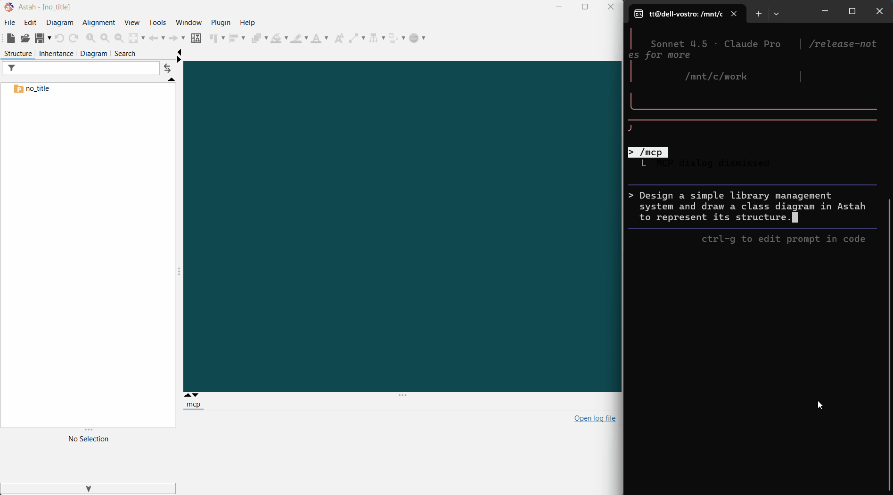
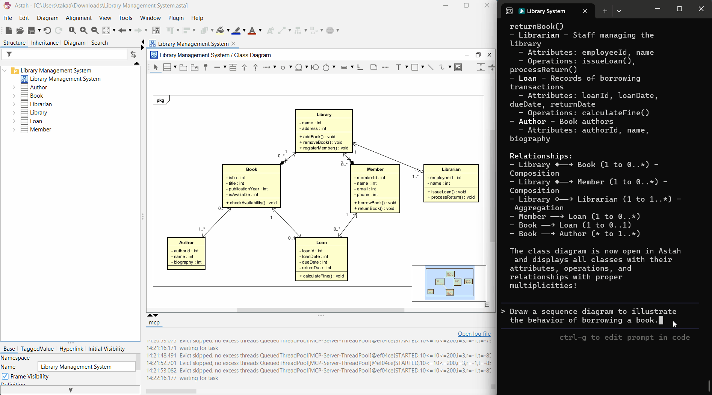
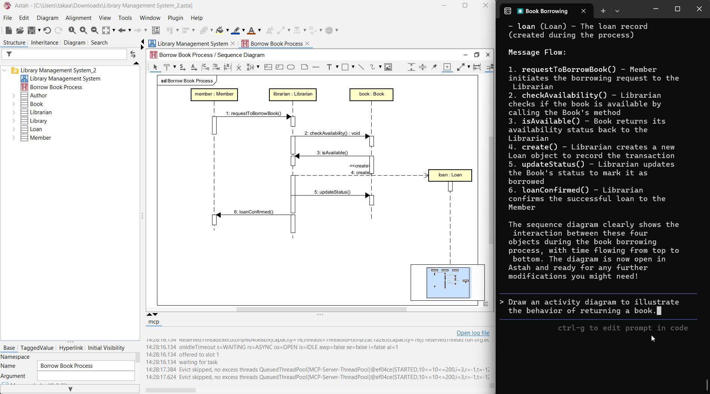
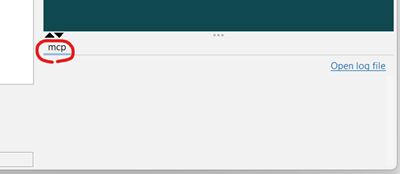
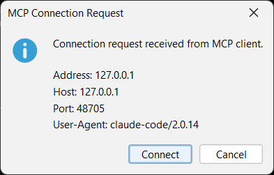

# UML Modeling Powered by AI Agents — Astah Pro MCP

A **local MCP server** that runs as a plugin for **Astah Professional**, a UML modeling tool. This MCP server enables you to do the following and more:

- Use AI to design systems and represent them as UML models and diagrams in Astah.
- Ask AI to explain UML models and diagrams in your Astah project.
- Generate source code from UML models and diagrams in your Astah project, and vice versa.
- Create UML diagrams in Astah from hand-drawn sketch images.

---

The videos below show *Claude Code* designing a simple library management system and drawing a class diagram, a sequence diagram, and an activity diagram. These videos are sped up 5×.

Prompt: *Design a simple library management system and draw a class diagram in Astah to represent its structure.*  


Prompt: *Draw a sequence diagram to illustrate the behavior of borrowing a book.*  


Prompt: *Draw an activity diagram to illustrate the behavior of returning a book.*  


<br>

> *Note:* As of October 10, 2025, AI assistants/agents are reasonably good at viewing and editing model information, but their ability to view and edit visual diagram information is still developing.

---

## System Requirements

- **Astah Professional v10.1 or later** is required. This does not work with Astah UML.

- Supported AI assistants/agents  
  - **Claude Desktop**  
  - **Claude Code**  
  - **Codex CLI**  
  - **Gemini CLI**

  <br>

  > *Note 1:* This MCP server exposes **200+** tool functions. Other AI assistants/agents may fail to connect due to the large number of tools, or may connect but only recognize a subset.

  > *Note 2:* This MCP server only connects to AI assistants/agents **running on the same machine** as Astah Professional. Under Astah's terms of use, using Astah via an AI assistant/agent running on a different machine is not permitted. For questions about these terms, please contact Change Vision (the developer of Astah) directly.

  > *Tip:* This is just the personal impression, but we recommend *Claude Code* or *Claude Desktop* because they use tool functions more appropriately. Additionally, if processing speed is your priority, go with *Claude Code*.

---

## Supported Diagram Types

This MCP server can view and edit the following diagrams (with more to come):

- **Class Diagram**  
- **Sequence Diagram**  
- **Activity Diagram**

---

## Installation

### Install Astah Professional

Download from [here](https://astah.net/downloads/) and install.

### Install the astah-pro-mcp Plugin

Download [the plugin JAR file](https://github.com/takaakit/astah-pro-mcp/releases), drop it into Astah, then restart Astah (see [this page](https://astahblog.com/2014/12/15/astah_plugins/)). After restarting, if you see an **'mcp'** tab in Astah's extensions view, the installation was successful.



### AI Assistant/Agent Settings

Add the following settings to connect to the MCP server using the *Streamable HTTP* transport.

#### Claude Desktop

<details>
<summary><code>claude_desktop_config.json</code></summary>

```json
{
  "mcpServers": {
    "astah-pro-mcp": {
      "command": "npx",
      "args": [
        "-y",
        "mcp-remote@latest",
        "http://127.0.0.1:8888/mcp",
        "--allow-http"
      ]
    }
  }
}
```
</details>

As of October 10, 2025, *Streamable HTTP* connections to a local MCP server don't seem to work well in *Claude Desktop*. Use a bridge such as [*mcp-remote*](https://github.com/geelen/mcp-remote), which requires *Node.js* v20 or later.

#### Claude Code

<details>
<summary><code>.mcp.json</code></summary>

```json
{
  "mcpServers": {
    "astah-pro-mcp": {
      "type": "http",
      "url": "http://127.0.0.1:8888/mcp"
    }
  }
}
```
</details>

Or run this command:
```bash
claude mcp add --transport http --scope project astah-pro-mcp http://127.0.0.1:8888/mcp
```

#### Codex CLI

<details>
<summary><code>config.toml</code></summary>

```toml
[mcp_servers.astah-pro-mcp]
command = "npx"
args = ["mcp-remote@latest", "http://127.0.0.1:8888/mcp", "--allow-http"]
```
</details>

As of October 10, 2025, *Streamable HTTP* connections to a local MCP server don't seem to work well in *Codex CLI*. Use a bridge such as [*mcp-remote*](https://github.com/geelen/mcp-remote), which requires *Node.js* v20 or later.

#### Gemini CLI

<details>
<summary><code>settings.json</code></summary>

```json
{
  "mcpServers": {
    "httpServer": {
      "httpUrl": "http://127.0.0.1:8888/mcp",
      "timeout": 5000
    }
  }
}
```
</details>

<br>

> **Important:** Use `127.0.0.1` instead of `localhost`. Connections to `localhost` will fail.

---

## How to Use

1. Start Astah (starting Astah also starts the MCP server).  
   Some AI assistants/agents try to connect to the MCP server on startup, so start Astah **first**.

2. Start the AI assistant/agent.  
   On the first connection to the MCP server, you will be asked to confirm. Review the details and click **'Connect'**.  
  

3. Send prompts to the AI assistant/agent.

<br>

> **Troubleshooting:** If *Claude Desktop* cannot connect to the MCP server, completely quit *Claude Desktop* (e.g., end the 'Claude' process in Task Manager), then restart it.

---

## Build & Test

If you want to build and test locally:

1. Set up your Astah plugin development environment (see [this page](https://astah.net/support/plugin-dev-tutorial/plugin-development-setup-for-astah-professional/)).

2. Build:
   ```bash
   astah-build
   ```

3. Run tests (update `astahPath` to match your Astah Professional installation path):

   Run all tests on Windows 11:
   ```bash
   astah-mvn test -DastahPath="C:\Program Files\astah-professional"
   ```

   Run specific tests on Windows 11:
   ```bash
   astah-mvn test -DastahPath="C:\Program Files\astah-professional" -Dtest="**/editor/*Test"
   ```

---

## Considerations

### Experimental Status
This project is currently **experimental**. The design and implementation may undergo breaking changes.

### Confidential Risk
Astah project data and logs will be shared with the AI assistant/agent. For Astah projects that contain confidential information, either refrain from using this MCP server or use it only with appropriate safeguards (e.g., enabling opt-out settings for AI assistants/agents).

### Backups Recommended
Because this MCP server edits models and diagrams, we recommend committing your Astah project to a Git repository or making copies before and during use so you can revert if necessary.

### Feature Limitations
Some model or diagram information (e.g., certain properties) cannot be viewed or edited via the provided tool functions. Use the Astah GUI directly for those.

### Costs
This MCP server prioritizes providing the information AI assistants/agents need and does **not** implement token-saving measures. We recommend using AI assistants/agents on a **flat-rate** plan rather than pay-as-you-go.

### AI Limitations
As with source code, AI assistants/agents can make mistakes or misinterpret UML models and diagrams.

---

## License

Some tool functions provided by this MCP server return excerpts from the [OMG UML 2.5.1](https://www.omg.org/spec/UML/2.5.1/PDF) and [OMG SysML 1.7](https://www.omg.org/spec/SysML/1.7/PDF) specifications. These specifications are licensed as stated at the beginning of each document. When a tool function returns such material, it explicitly indicates that it is an excerpt.

All other source code is copyrighted by **Takaaki Teshima** and released under the **MIT-0** license.  
[](https://opensource.org/licenses/MIT-0)

---

## Got a feature request or found a bug?

Please open an [issue](https://github.com/takaakit/astah-pro-mcp/issues). Because this project is experimental and may undergo breaking changes, we're not currently accepting pull requests. Thank you for your understanding.

---

## Need support?

If you need private support, contact `takaaki.teshima.dev [at] gmail.com` (replace `[at]` with `@`). It could become a paid project; I may still be able to support you/it.
