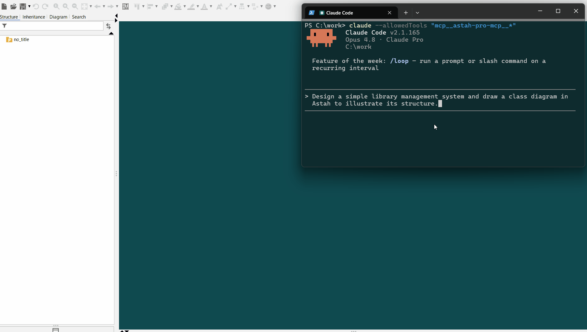
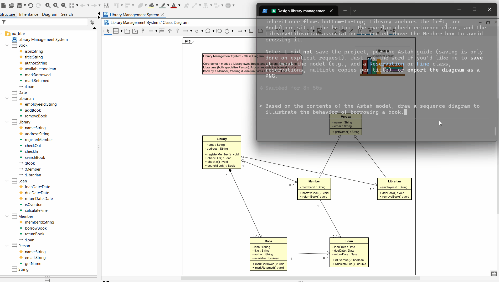
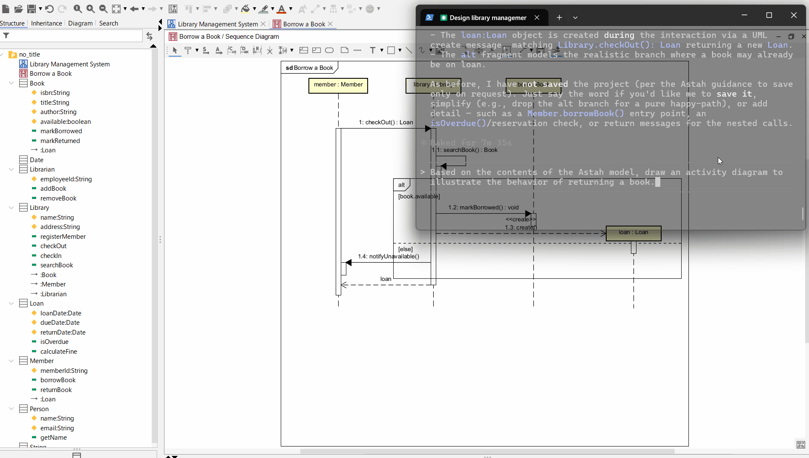
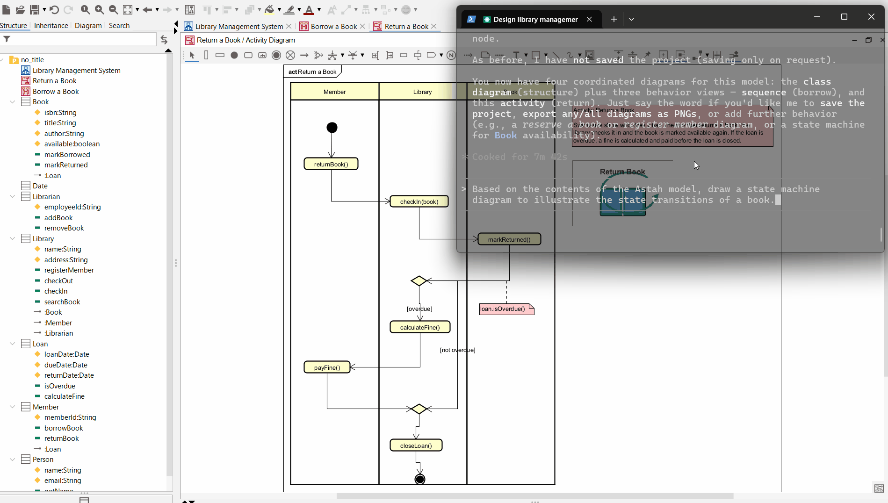
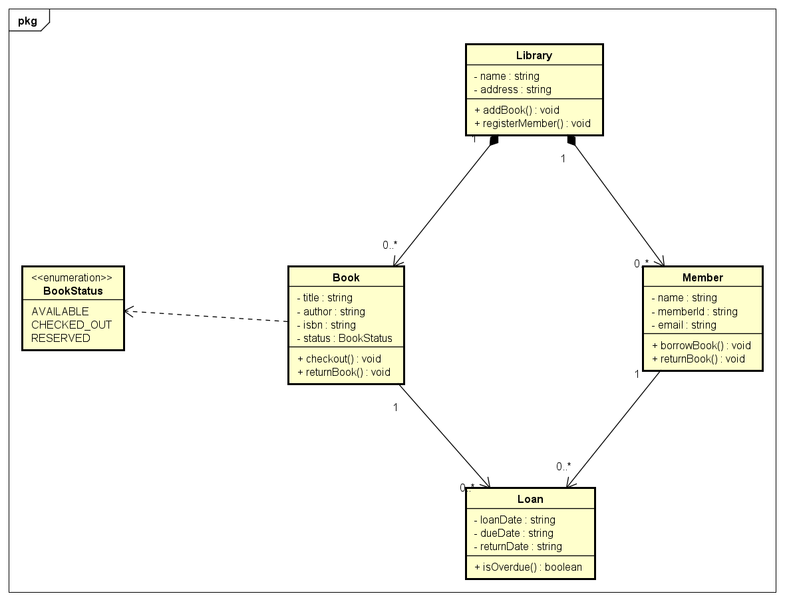
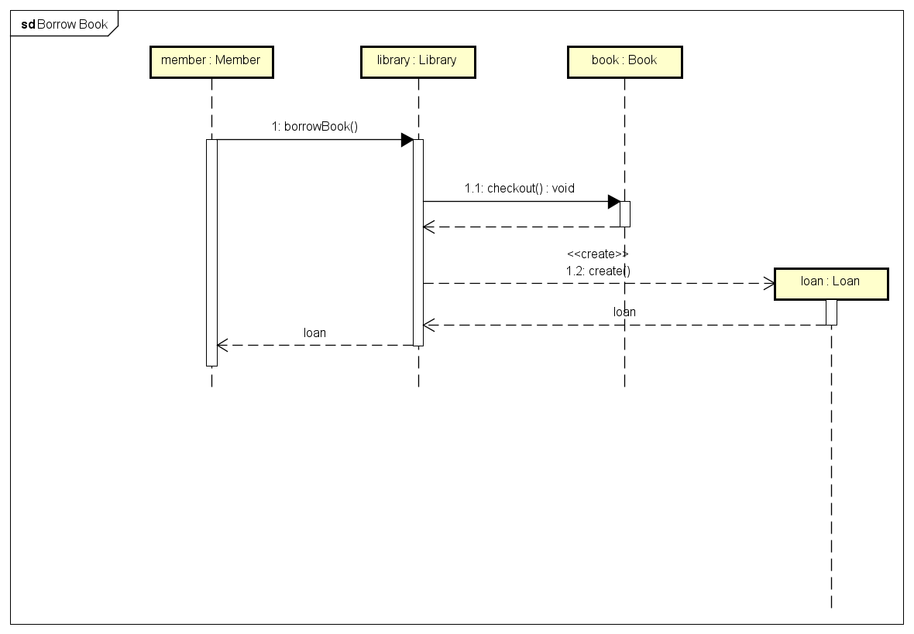
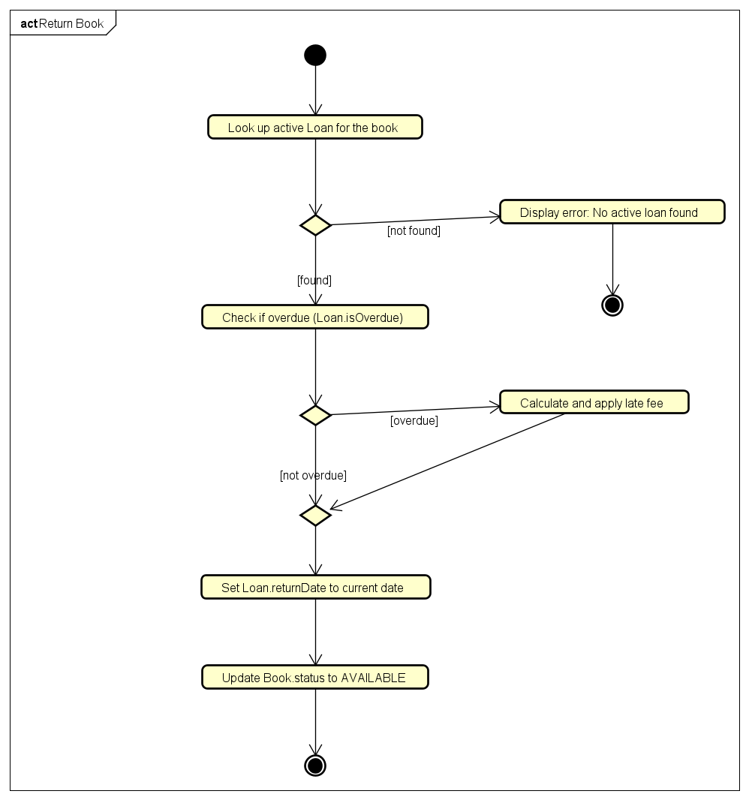
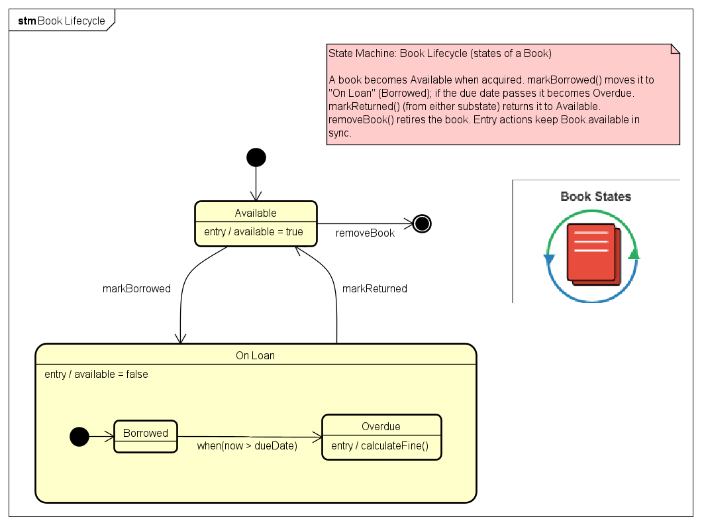
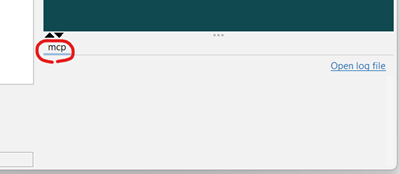
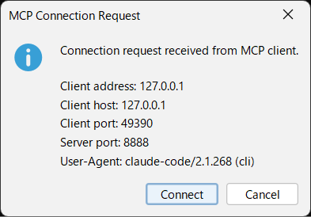

# Astah Pro MCP: Enabling AI-Powered UML Modeling

A local MCP server plugin for Astah Professional, a UML modeling tool, that enables AI agents to:

- Design systems and represent them as UML models.
- Explain UML models.
- Generate source code from UML models, and vice versa.
- Create UML diagrams from hand-drawn sketches.

<br>

These videos show Claude Code (Opus 4.8) designing a simple library management system and drawing diagrams. They are played at 20× speed.

Prompt: *Design a simple library management system and draw a class diagram in Astah to illustrate its structure.*  


Prompt: *Based on the contents of the Astah model, draw a sequence diagram to illustrate the behavior of borrowing a book.*  


Prompt: *Based on the contents of the Astah model, draw an activity diagram to illustrate the behavior of returning a book.*  


Prompt: *Based on the contents of the Astah model, draw a state machine diagram to illustrate the state transitions of a book.*  


<br>

Diagrams created in the videos above: The diagram layouts were manually adjusted.
<table>
  <tr>
    <td><a href="img/class-diagram.png"></a></td>
    <td><a href="img/sequence-diagram.png"></a></td>
    <td><a href="img/activity-diagram.png"></a></td>
    <td><a href="img/state-machine-diagram.png"></a></td>
  </tr>
</table>

<br>

## Requirements

- **Astah Pro v12.0 or later**

- AI agents
  - For the full (query + edit) tool version:

    With around **400** tools exposed in this version, use the AI agents listed below. Other AI agents may fail to connect due to the large number of tools, or may connect but only recognize a subset.
    - **Claude Code**
    - **Codex CLI**
    - **Grok Build**
    - **Antigravity CLI**

  - For the query-only tool version:

    This version exposes around **150** tools, so many AI agents will likely be able to use it. Note that the AI agent can only reference information about model elements and diagrams.

  <br>

  > *Note:* This MCP server only connects to AI agents running on the same machine as Astah Professional.
  According to Astah's terms of use, using Astah via an AI agent is permitted only if you hold a valid license and access it exclusively for your own use with your licensed Astah. Allowing a non-licensed third party to operate Astah via such an agent is strictly prohibited.  
  For details, please refer to the FAQ ([English](https://astah.net/support/cv-members-guide/#ai-external-access) / [Japanese](https://astah.change-vision.com/ja/faq/faq-license/ai-external-access.html)) or [contact Change Vision (the developer of Astah)](https://astah.net/about/contact/) directly.

<br>

## Supported Diagram Types

This MCP server can view and edit the following diagrams:

- **Class Diagram**  
- **Sequence Diagram**  
- **Activity Diagram**
- **State Machine Diagram**
- **Usecase Diagram**
- **Mind Map**
- **Requirement Diagram**
- **Communication Diagram** (query-only)
- **Composite Structure Diagram** (query-only)
- **ER Diagram** (query-only)

<br>

## Installation

### Install Astah Pro

Download from [here](https://astah.net/downloads/) and install.

### Install the Astah Pro MCP plugin

Download [the plugin JAR file (astah-pro-mcp-x.x.x.jar)](https://github.com/takaakit/astah-pro-mcp/releases), drop it into Astah, and restart Astah (see [here](https://astahblog.com/2014/12/15/astah_plugins/)). If the `mcp` tab appears in the Extensions view, the plugin is installed.



### AI agent settings

To use the full tool version, specify port `8888`; to use the query-only tool version, specify port `8889`. Also, use `127.0.0.1` not `localhost`. Connections to `localhost` will fail.

If those ports are already taken on your machine, see [Changing the port numbers](#changing-the-port-numbers).

<details>
<summary><b>Claude Code</b></summary>

Run this command for project scope in your project directory:
```bash
claude mcp add --transport http --scope project astah-pro-mcp http://127.0.0.1:8888/mcp
```

Or run this command for user scope:
```bash
claude mcp add --transport http --scope user astah-pro-mcp http://127.0.0.1:8888/mcp
```

</details>


<details>
<summary><b>Codex CLI</b></summary>

Create `.codex/config.toml` under your project directory or your user directory with:

```toml
[mcp_servers.astah-pro-mcp]
transport = "http"
url = "http://127.0.0.1:8888/mcp"
startup_timeout_sec = 10
```

</details>


<details>
<summary><b>Grok Build</b></summary>

Run this command for project scope in your project directory:
```bash
grok mcp add --scope project --transport http astah-pro-mcp http://127.0.0.1:8888/mcp
```

Or run this command for user scope:
```bash
grok mcp add --scope user --transport http astah-pro-mcp http://127.0.0.1:8888/mcp
```

</details>


<details>
<summary><b>Antigravity CLI</b></summary>

Create `.agents/mcp_config.json` under your project directory, or create `~/.gemini/antigravity-cli/mcp_config.json` for user scope.

```json
{
  "mcpServers": {
    "astah-pro-mcp": {
      "serverUrl": "http://127.0.0.1:8888/mcp"
    }
  }
}
```

If the direct connection above does not work, fall back to the following configuration using mcp-remote:

```json
{
  "mcpServers": {
    "astah-pro-mcp": {
      "command": "npx",
      "args": [
        "-y",
        "mcp-remote@latest",
        "http://127.0.0.1:8888/mcp",
        "--allow-http"
      ]
    }
  }
}
```

</details>

<br>

## Changing the Port Numbers

The plugin listens on `8888` (full tool version) and `8889` (query-only tool version) by default. Each port can be overridden with an environment variable:

| Tool version | Environment variable |
| --- | --- |
| Full | `ASTAH_PRO_MCP_PORT_FOR_FULL` |
| Query-only | `ASTAH_PRO_MCP_PORT_FOR_QUERY` |

Remember to update your AI agent settings to the same port numbers.

<br>

## How to Use

1. Start Astah Pro

   Some AI agents try to connect to the MCP server on startup, so start Astah Pro **first**.

2. Start AI agents

   On the first connection to the Astah Pro MCP server, you will be asked to confirm. Review the details and click **'Connect'**.  
  

   > *Note:* As of July 31, 2026, the latest version of Codex CLI shows this confirmation dialog twice.

3. Send prompts to the AI agents

If you want to disable the Astah Pro MCP plugin in Astah, click [Plugin] > [Installed Plugin], select the *Astah Pro MCP* entry in the plugin list dialog, click Disable, and then restart Astah.

<br>

## Build & Test

If you want to build and test locally:

1. Set up your Astah plugin development environment (see [here](https://astah.net/support/plugin-dev-tutorial/plugin-development-setup-for-astah-professional/)).

2. Build:
   ```bash
   astah-build
   ```

3. Run tests (change `astahPath` to your Astah Pro installation path):

   Run all tests on Windows 11:
   ```bash
   astah-mvn test -DastahPath="C:\Program Files\astah-professional"
   ```

   Run specific tests on Windows 11:
   ```bash
   astah-mvn test -DastahPath="C:\Program Files\astah-professional" -Dtest="**/editor/*Test"
   ```

<br>

## Considerations

### Experimental Status
This project is currently **experimental**. The design and implementation may undergo breaking changes.

### Confidential Risk
Astah project data and logs will be shared with the AI agent. For Astah projects that contain confidential information, either refrain from using this MCP server or use it only with appropriate safeguards (e.g., enabling opt-out settings for AI agents).

### Backups Recommended
Because this MCP server edits model elements and diagrams, we recommend committing your Astah project to a Git repository or making copies before and during use so you can revert if necessary.

### Feature Limitations
Some model or diagram information (e.g., certain properties) cannot be viewed or edited via the provided tool functions. Use the Astah GUI directly for those.

### Costs
This MCP server prioritizes providing the information AI agents need and does **not** implement token-saving measures. We recommend using AI agents on a **flat-rate** plan rather than pay-as-you-go.

### AI Limitations
As with source code, AI agents can make mistakes or misinterpret model elements and diagrams.

<br>

## License

Some tool functions provided by this MCP server return excerpts from the [OMG UML 2.5.1](https://www.omg.org/spec/UML/2.5.1/PDF), [OMG SysML 1.7](https://www.omg.org/spec/SysML/1.7/PDF) specifications, and [FIPS PUB 184 IDEF1X](https://www.govinfo.gov/app/details/GOVPUB-C13-986bf8b12a4fed44eb78fca0bb55d668). The OMG UML/SysML specifications are licensed as stated at the beginning of each document. FIPS PUB 184 IDEF1X is a U.S. Government work (NIST) and is not subject to copyright protection in the United States (17 U.S.C. §105), but may be subject to foreign copyright. When content from these specifications/documents is returned by tool functions, it is explicitly indicated as an excerpt. "Mind Map" is a registered trademark of The Buzan Organisation Limited.

One tool function returns UML diagram consistency rules quoted from the papers below. Copyright of these rule statements remains with their authors and publishers; they are quoted with attribution and explicitly indicated as excerpts.
- Torre, Damiano, et al. "A systematic identification of consistency rules for UML diagrams." Journal of Systems and Software 144 (2018): 121-142.
- Torre, Damiano, et al. "How consistency is handled in model-driven software engineering and UML: an expert opinion survey." Software Quality Journal 31.1 (2023): 1-54.

All other works, including source code, are copyrighted by **Takaaki Teshima** and released under the **MIT-0** license.  
[](https://opensource.org/licenses/MIT-0)

<br>

## Disclaimer

This project is developed independently by the authors in their personal capacities and is not affiliated with any university, institution, or employer.

<br>

## Got a feature request or found a bug?

Please open an [issue](https://github.com/takaakit/astah-pro-mcp/issues). Because this project is experimental phase and may introduce breaking changes, we aren't accepting pull requests until the design and implementation stabilize. Thank you for your understanding.

<br>

## Need support?

If you need private support, contact `takaaki.teshima.dev [at] gmail.com` (replace `[at]` with `@`). It could become a paid project; I may still be able to support you/it.
